<div align="center">
  
  <h1>Guia de Administração: Conteúdo Dinâmico</h1>
  <p>Manual oficial para cadastro, padronização e manutenção de mídias no portal.</p>
  <p>© ViselBrx e DaviMoraes07</p>
  <br>
  <p>
    
    
    
    
  </p>
</div>

---

## Índice

1. [Visão Geral do Sistema](#visão-geral-do-sistema)
2. [Objetivo deste Manual](#objetivo-deste-manual)
3. [Estrutura de Conteúdo](#estrutura-de-conteúdo)
4. [Padrões Gerais de Cadastro](#padrões-gerais-de-cadastro)
5. [Tutorial de Cadastro: Vídeos](#tutorial-de-cadastro-vídeos)
6. [Tutorial de Cadastro: Mangás (PDF)](#tutorial-de-cadastro-mangás-pdf)
7. [Espaço para Prints](#espaço-para-prints)
8. [Checklist de Publicação](#checklist-de-publicação)
9. [Boas Práticas e Recomendações](#boas-práticas-e-recomendações)

---

## Visão Geral do Sistema

Este manual foi criado para administradores e colaboradores responsáveis pela publicação de conteúdos no portal. O objetivo é garantir que animes, desenhos, filmes e mangás sigam um padrão visual, técnico e organizacional consistente.

Seguir este processo ajuda a evitar erros de exibição, links inválidos e inconsistências no catálogo, além de facilitar a manutenção do sistema.

---

## Objetivo deste Manual

Este documento tem como finalidade:

- padronizar o cadastro de mídias;
- orientar a equipe sobre o formato correto de publicação;
- reduzir erros operacionais no painel;
- garantir consistência visual no portal;
- facilitar futuras revisões e atualizações.

---

## Estrutura de Conteúdo

O portal está organizado em 4 categorias principais:

| Ícone | Categoria | Tipo de Item | Estrutura | Observação |
| :---: | :--- | :--- | :--- | :--- |
| 🎨 | **Desenhos** | Episódios | Série por temporada | Possui múltiplos episódios. |
| 🎌 | **Animes** | Episódios | Série por temporada | Possui múltiplos episódios. |
| 🎬 | **Filmes** | Único | Conteúdo individual | Não possui episódios. |
| 📚 | **Mangás** | Volumes | Publicação sequencial | Possui múltiplos volumes ou capítulos. |

### 1. Desenhos

Conteúdos seriados organizados por temporada e episódio, quando aplicável.

### 2. Animes

Segue a mesma lógica dos desenhos, com atenção à numeração correta dos episódios e aos títulos.

### 3. Filmes

Conteúdo unitário, cadastrado como item único.

### 4. Mangás

Conteúdos organizados por volumes ou capítulos. O arquivo pode ser enviado diretamente ou por link externo.

---

## Padrões Gerais de Cadastro

Antes de publicar qualquer conteúdo, verifique:

- títulos padronizados e sem abreviações desnecessárias;
- ortografia, acentuação e capitalização;
- categoria correta do conteúdo;
- funcionamento de links, iframes e arquivos;
- consistência entre nome, capa e navegação;
- ausência de itens duplicados.

---

## Tutorial de Cadastro: Vídeos

Esta seção se aplica a:

- **Desenhos**
- **Animes**
- **Filmes**

Para esses conteúdos, é utilizada a plataforma **RedeCanais**, de onde será obtido o código de incorporação (`iframe`) do player.

### Passo a Passo para Obter o Iframe

1. **Acesse o RedeCanais**  
   Entre em `redecanais.cafe`. Se o domínio oficial mudar, substitua apenas o final `.cafe` pelo novo domínio em uso.

2. **Pesquise o título desejado**  
   Use a busca para localizar o conteúdo.

3. **Abra o item correto**  
   - Para **desenhos** e **animes**, selecione o episódio exato.
   - Para **filmes**, abra a página do filme.
   - O RedeCanais costuma abrir várias janelas pop-up. Basta fechar as janelas extras e voltar para a página em que você estava.

4. **Localize a opção de incorporação**  
   Na área do player, procure a opção de código `iframe` ou `embed`.

5. **Copie o código completo**  
   Copie integralmente o bloco `<iframe>` e ajuste para `height="450"` e `width="800"`.

6. **Cole no campo correspondente do CMS**  
   Insira o iframe no campo apropriado do painel administrativo.

### Padrão de Estilo do Player

Após colar o código no CMS, ajuste largura e altura para manter o padrão visual do portal.

```html
<iframe
  src="https://embed.exemplo.com/..."
  height="450"
  width="800"
  frameborder="0"
  allowfullscreen>
</iframe>
```

### Diretrizes Importantes para Vídeos

- não altere o `src` original, salvo necessidade;
- mantenha o código limpo, sem atributos extras;
- confirme se o player carrega corretamente;
- valide se o conteúdo corresponde ao título e episódio cadastrados.

---

## Tutorial de Cadastro: Mangás (PDF)

O cadastro de mangás pode ser feito de duas formas, conforme o tamanho do arquivo e a estratégia de hospedagem.

### Opção A: Upload Direto

Use esta opção quando o PDF estiver dentro do limite suportado pelo painel.

**Recomendado para arquivos de até 50 MB.**

#### Etapas

1. Acesse o painel administrativo.
2. Vá até a seção de cadastro de mangás.
3. Preencha os dados principais.
4. Faça o upload do PDF no campo indicado.
5. Salve e revise a publicação.

#### Vantagens

- processo mais rápido;
- gerenciamento centralizado no sistema;
- menor dependência de serviços externos.

### Opção B: Link do Google Drive

Use esta opção quando o PDF for muito grande ou quando houver necessidade de hospedagem externa.

#### Etapas

1. Acesse um link do Google Drive ou outro serviço que permita incorporar PDFs relacionados a mangás.
2. Abra a caixa menor de compartilhamento ou visualização do arquivo.
3. Copie o link do PDF do volume desejado.
4. Clique com o botão esquerdo para confirmar a ação, quando necessário.
5. Insira o link no campo correspondente do painel.
6. Salve e teste o acesso.

#### Vantagens

- melhor suporte a arquivos grandes;
- maior flexibilidade de armazenamento;
- possibilidade de atualização externa do arquivo.

#### Atenção

- valide se o link está acessível sem exigir login;
- confirme se o arquivo corresponde ao volume correto;
- padronize a nomenclatura dos arquivos antes do envio.

---

## Espaço para Prints

Os prints abaixo documentam o fluxo completo de cadastro. Todos os arquivos estão dentro da pasta `.prints/`.

### Screen 1: Acessar o RedeCanais

Acesse `redecanais.cafe`. Se trocarem de domínio, altere apenas o final `.cafe` para o novo domínio oficial.

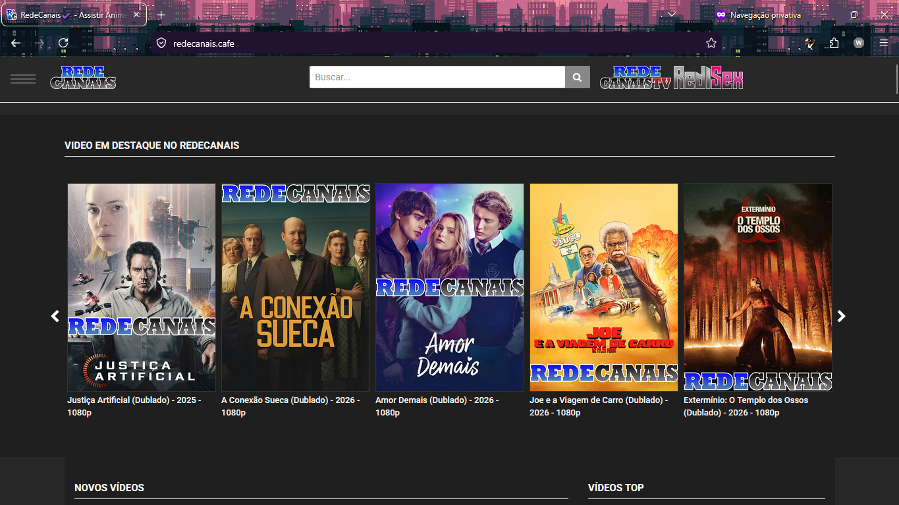

### Screen 2: Pesquisar o conteúdo desejado

Use a busca para localizar o anime, desenho ou filme que será cadastrado.

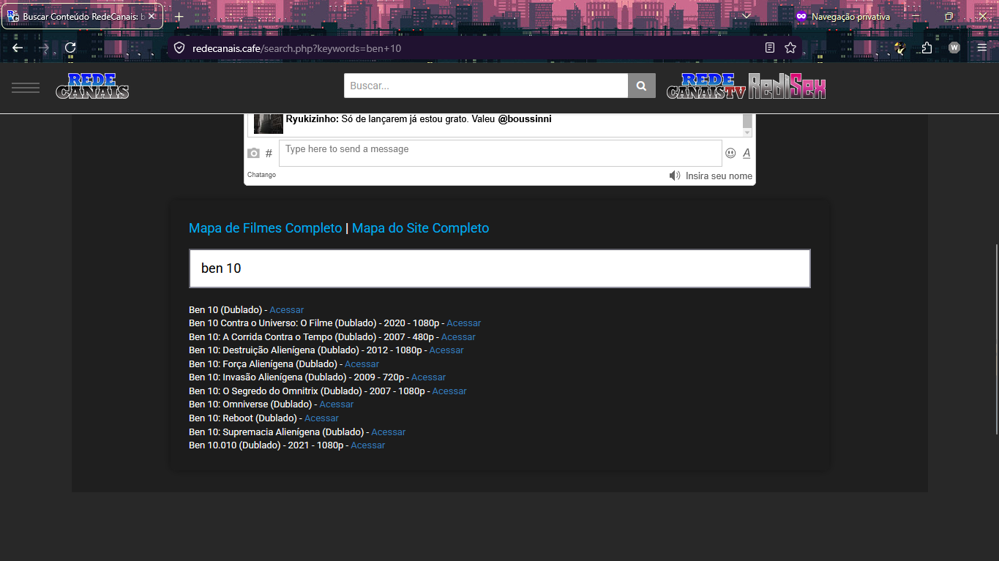

### Screen 3: Entrar no episódio ou filme

Abra o episódio ou filme correto. O RedeCanais é rígido com pop-ups e pode abrir várias janelas. Basta fechar as janelas extras e voltar para a página em que você estava.

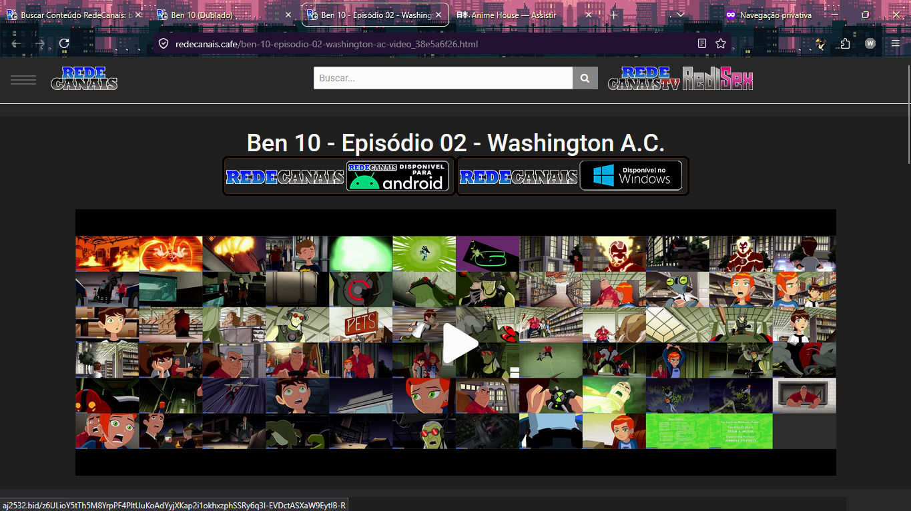

### Screen 4: Pegar o código iframe

Localize a opção de `iframe` ou `embed` e clique nela.

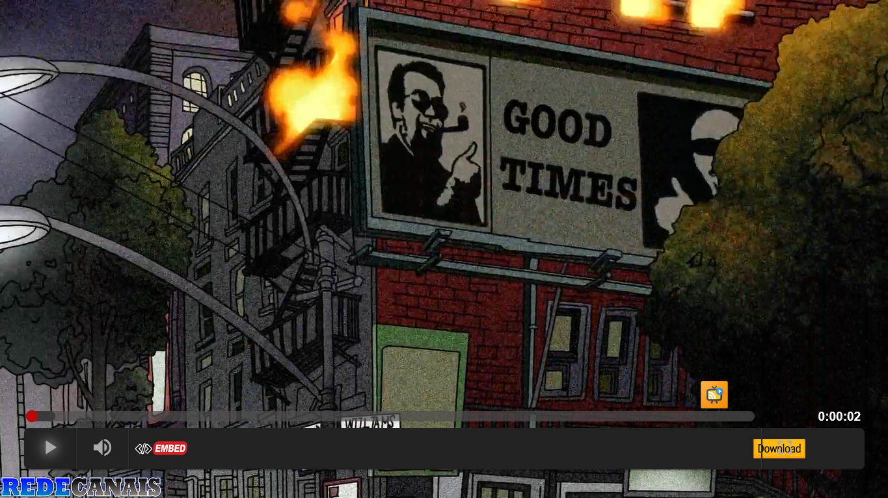

### Screen 5: Ajustar o iframe

Copie o `iframe` e ajuste o padrão para `height="450"` e `width="800"` antes de salvar no CMS.

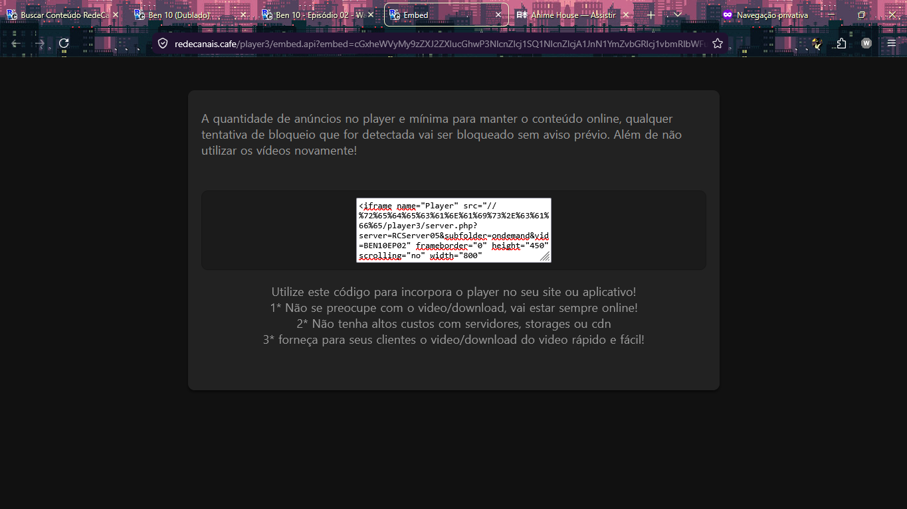

### Screen 6: Demonstração do cadastro implementado

Exemplo de como o cadastro finalizado deve ficar no sistema.

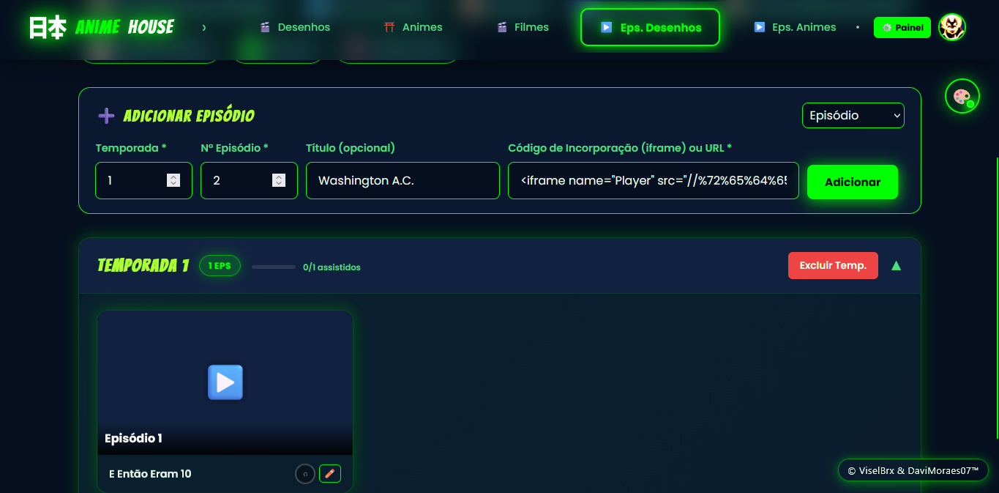

### Screen 7: Abrir o link do PDF

Acesse um link do Google Drive ou de outro serviço que permita incorporar PDFs relacionados a mangás.

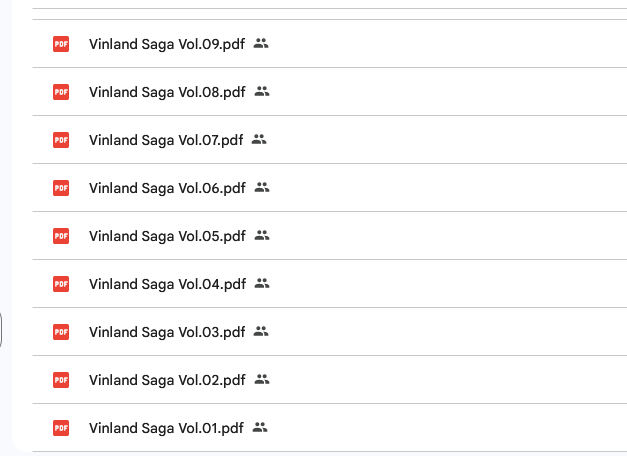

### Screen 8: Abrir a caixa menor e selecionar o volume

Abra a caixa menor, localize o PDF do volume desejado e clique com o botão direto para selecionar.

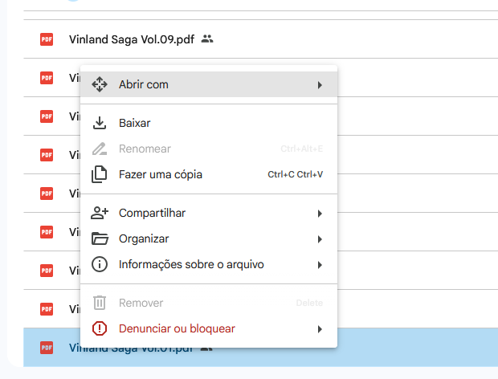

### Screen 9: Copiar o link do volume

Copie o link do volume que será usado no cadastro.

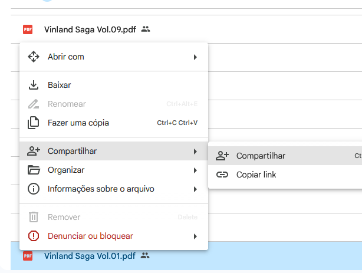

### Screen 10: Demonstração do cadastro do volume

Exemplo de como fica o cadastro de um volume de mangá dentro do painel.

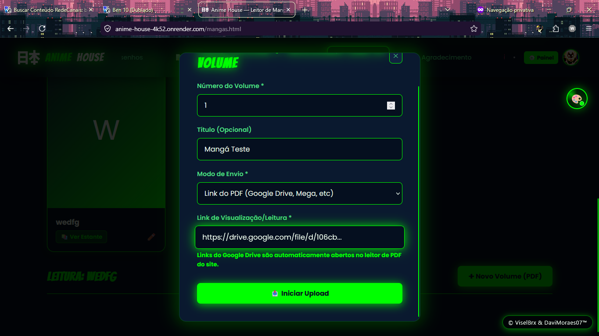

### Screen 11: Volume aberto com PDF integrado

Exemplo do volume aberto com o PDF incorporado corretamente no portal.

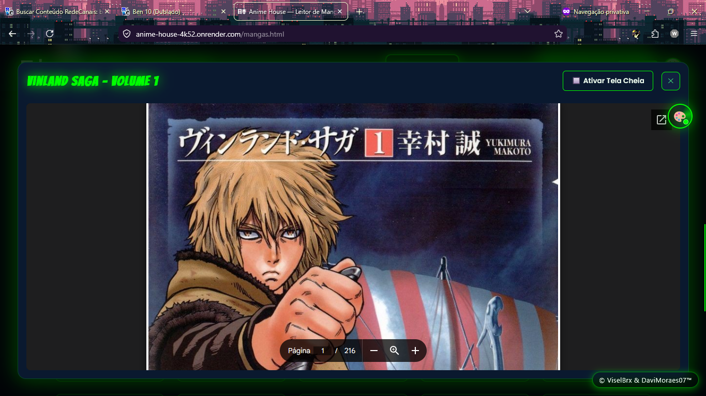

---

## Checklist de Publicação

Antes de finalizar qualquer cadastro, confirme:

- [ ] O conteúdo foi cadastrado na categoria correta.
- [ ] O título está padronizado e revisado.
- [ ] A capa ou mídia visual está correta.
- [ ] O iframe ou arquivo foi inserido corretamente.
- [ ] O conteúdo abre sem erros.
- [ ] O episódio, filme ou volume corresponde ao item publicado.
- [ ] A formatação segue o padrão definido neste manual.
- [ ] Não existe duplicidade do mesmo conteúdo no sistema.

---

## Boas Práticas e Recomendações

Para manter o portal com padrão profissional:

- revise o conteúdo antes da publicação;
- evite publicar materiais incompletos;
- mantenha coerência entre título, descrição e mídia;
- use sempre a fonte oficial definida pela operação;
- documente exceções internamente;
- priorize consistência visual e de navegação.

### Erros mais comuns a evitar

- cadastrar episódio incorreto;
- colar iframe incompleto;
- esquecer de ajustar `width` e `height`;
- publicar links quebrados;
- inserir mangá com permissão privada no Google Drive;
- criar entradas duplicadas por falta de conferência.

---

<div align="center">
  <sub>Documento administrativo interno • Uso exclusivo da equipe de cadastro e manutenção de conteúdo</sub><br/>
</div>
